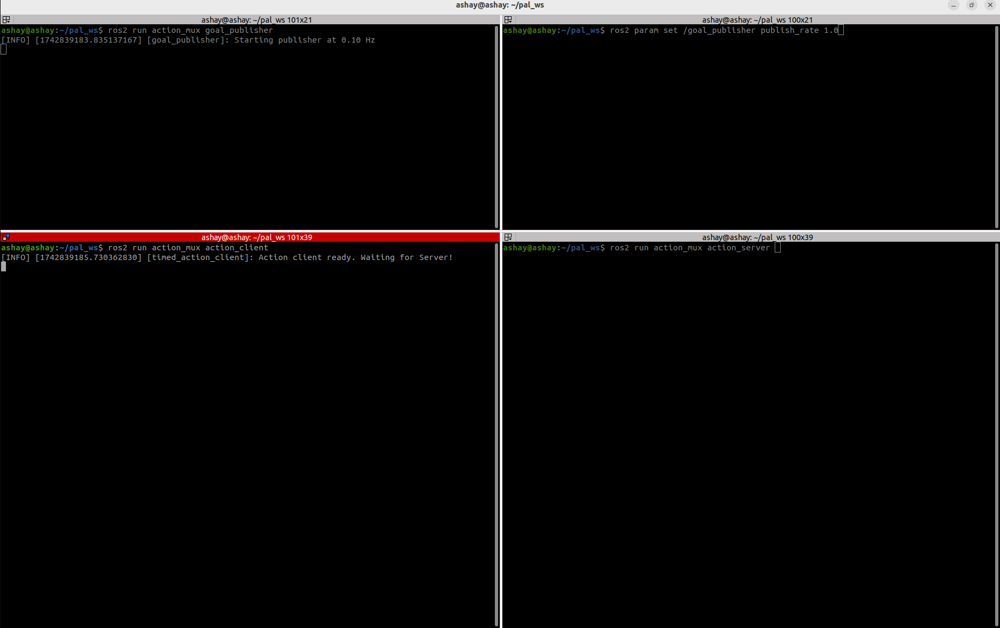
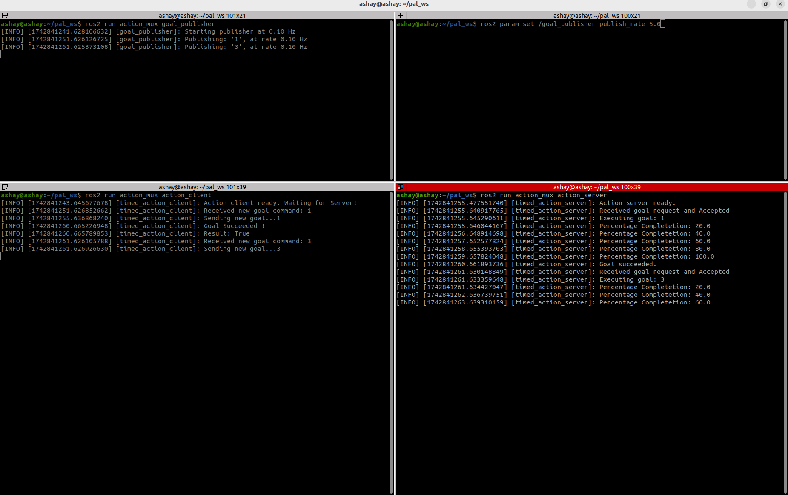
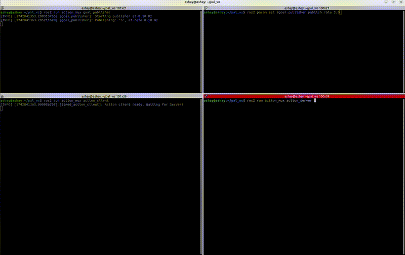
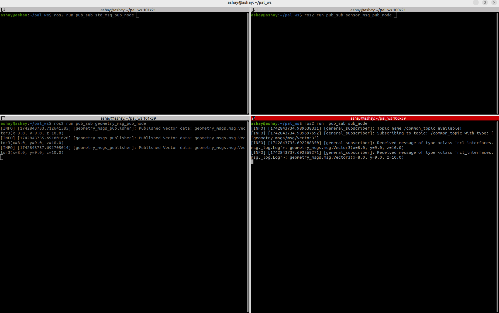
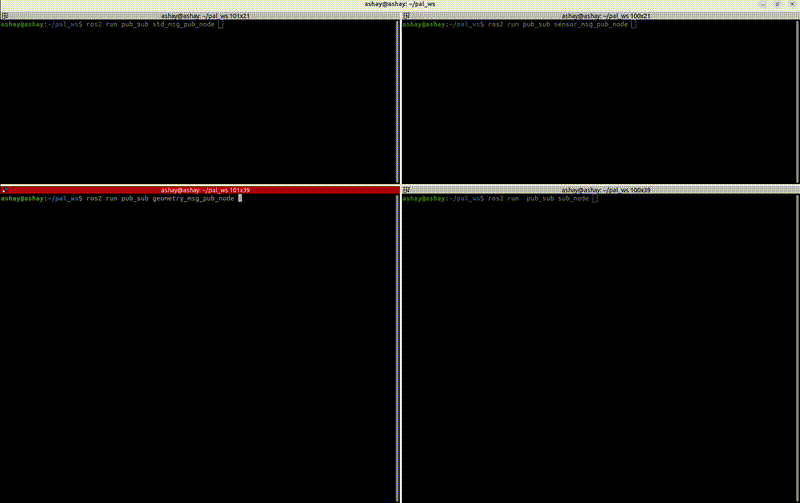

# pal_ws
This repo hosts code solution to "ROS2 Action MUX" problem by PAL robotics for GSoC 2025. Repo has 3 ros2 packages, namely - action_mux, custom_action and pub_sub, with directory shown in codemap.

## Codemap
    .
    ├── README.md
    └── src
        ├── action_mux                             ----
        │   ├── action_mux                            |
        │   │   ├── action_client.py                  |
        │   │   ├── action_server.py                  |
        │   │   ├── goal_publisher.py                 |
        │   │   ├── __init__.py                       |
        │   │   └── __pycache__                       |
        │   ├── package.xml                           |
        │   ├── resource                              |------ Exercise 1
        │   │   └── action_mux                        |
        │   ├── setup.cfg                             |
        │   └── setup.py                              |
        ├── custom_action                             |
        │   ├── action                                |
        │   │   └── CustomGoal.action                 |
        │   ├── CMakeLists.txt                        |
        │   └── package.xml                        ----
        └── pub_sub                                ----
            ├── package.xml                           |
            ├── pub_sub                               |
            │   ├── geometry_msg_pub_node.py          |
            │   ├── __init__.py                       |
            │   ├── __pycache__                       |
            │   ├── sensor_msg_pub_node.py            |------ Exercise 2
            │   ├── std_msg_pub_node.py               |
            │   └── sub_node.py                       |
            ├── resource                              |
            │   └── pub_sub                           |
            ├── setup.cfg                             |
            └── setup.py                           ----
            
* action_mux : Has action client, action server and goal publisher nodes (Exercise 1).
* custom_action : Hosts a custom action implemented to be used by node in action_mux package.
* pub_sub : Host the solution publisher and subcriber node for Exercise 2.

## Requirements
* Local ROS2 Humble installation.
* (Optional) Terminator to split terminal windows and ease of running multiple commands.

## Setup
### Clone the repo
```
git clone git@github.com:wakodeashay/pal_ws.git
```
### Build as a ros2 workspace
```
cd pal_ws
source /opt/ros/humble/setup.bash
colcon build --symlink-install
```
### Source the build
```
source install/setup.bash
```

### Setup tested for following configuration:
* Processor: 13th Gen Intel® Core™ i7-13700H × 20
* RAM: 16 Gib
* OS Name: Ubuntu 22.04.5 LTS
* ROS Distro: Humble 
* Gazebo Distro: Harmonic 


## Running Exercises
### Exercise 1
* Step 1: Start goal publisher and action_client nodes in seperate terminals. Here, goal publisher would start publishing goal at a smaller rate and action client would subscribe to those goals while remianing idle and waiting for the server.
    ```
    ros2 run action_mux goal_publisher 
    ```

    ```
    ros2 run action_mux action_client 
    ```
    

* Step 2: Start server and check the behaviour.
    ```
    ros2 run action_mux action_server 
    ```
       

* Step 3: Change the goal publish rate fynamically and check the behaviour

       

* Additional features: Dynamic parameter change for publisher node, which allows changing publish rate without rebooting the publisher node with new publish rate.

### Exercise 2

* Step 1: Start a publisher node of your choice. Use the commands below to start the respective publishers.

    ```
    ros2 run pub_sub std_msg_pub_node
    ```

    ```
    ros2 run pub_sub sensor_msg_pub_node
    ```

    ```
    ros2 run pub_sub geometry_msg_pub_node
    ```

* Step 2: Start the subscriber node in a different terminal.
    ```
    ros2 run  pub_sub sub_node
    ```
     

* Step 3: Check the behaviour. To check alternate publisher, shutdown the previous publisher and subsciber pair using Ctrl+c and start a new one.

     
